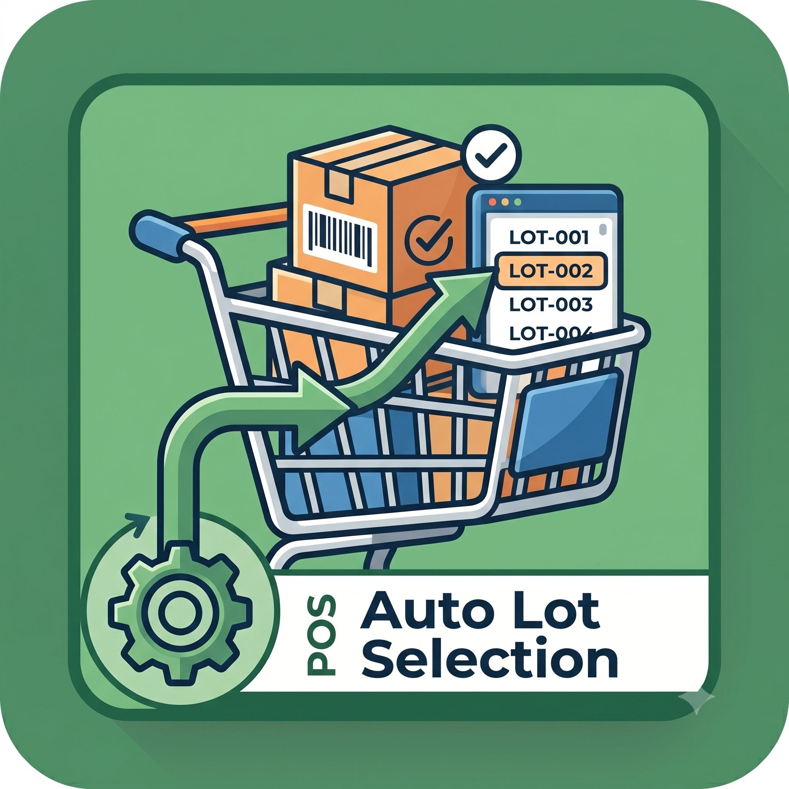

  
  
  # POS Auto Lot & Serial Selection (Odoo 18)
  
  *Supercharge your retail checkout speed. Completely eliminate manual lot selection popups by automatically assigning the oldest available stock directly to your Point of Sale cart.*

  
  
  

---

## 🚀 Core Advantages

- **⚡ Lightning Fast:** No more UI interruptions. Cashiers can scan and sell instantly without stopping to type or select lot numbers.
- **🔄 Smart FEFO/FIFO:** Automatically queries your backend database to fetch and assign the oldest stock first, reducing inventory waste.
- **🧩 Dynamic Multi-Quantity:** Seamlessly handles multi-quantity increments at the POS counter and maps unique serial numbers instantly.
- **🛡️ Native Fallback:** If stock runs out or discrepancies occur, the module gracefully falls back to the native Odoo popup, preventing register blocks.

## 🛠️ How It Works

1. **Product Selection:** The cashier clicks or scans a tracked product (Lot or Serial).
2. **Background Interception:** Our Owl JavaScript patch pauses the UI and silently pings the Python backend.
3. **Database Query:** The system filters `stock.quant` for the active POS location, ignoring serials already in the draft cart.
4. **Instant Assignment:** The oldest valid numbers are mapped to the cart line, bypassing the modal completely.

## ⚠️ Important Prerequisites

> **Note:** For this automation to trigger flawlessly, your database must be properly normalized. This module relies strictly on assigned Lot/Serial numbers.

* **Legacy Untracked Stock:** If you have old inventory sitting in your POS location that was received *without* a lot number, the automation will ignore it. 
* **Action Required:** Before going live, you must either sell out your old untracked stock manually, or perform an **Inventory Adjustment** in the backend to assign a dummy lot number (e.g., `LEGACY-BATCH`) to those existing quantities.
* **Configuration:** Ensure your POS Operation Type has **"Use Existing Lots/Serial Numbers"** enabled in the backend.

## 📥 Installation

1. Clone or download this repository into your Odoo `addons` path.
2. Update your Odoo server configuration file or start command to include the addons path.
3. Restart your Odoo server instance.
4. Log in as an Administrator, activate **Developer Mode**, and click **Update Apps List**.
5. Search for `POS Auto Lot/Serial Selection` and click **Install**.

## 👨‍💻 Technical Details

This module relies on clean, non-intrusive architecture:
- **Frontend:** Patches the `PosStore.prototype.editLots` method in Odoo's Owl framework to suppress the `EditListPopup`.
- **Backend:** Extends `pos.session` with an optimized ORM query to fetch and sort `stock.quant` records by expiration and creation dates.

---

  <b>Developed with ❤️ for Odoo 18 by Udaykiran</b> 
  
  
  

